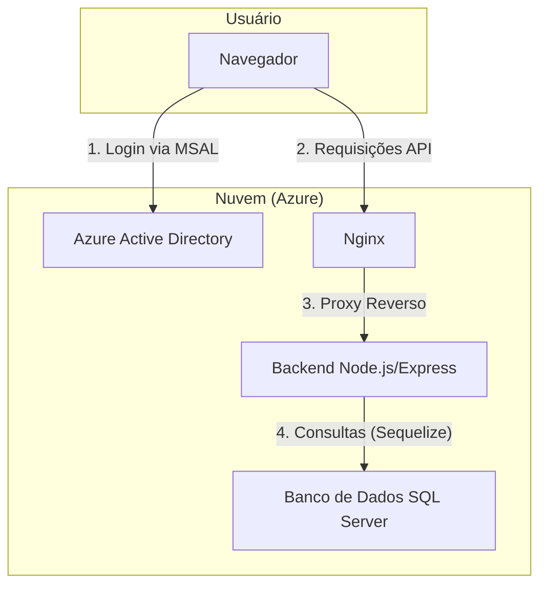

# Documento de Arquitetura Técnica

## 1. Visão Geral

Este documento descreve a arquitetura técnica da aplicação de denúncias, detalhando o frontend, backend, banco de dados e a infraestrutura de implantação.

## 2. Arquitetura do Sistema

A aplicação segue uma arquitetura cliente-servidor desacoplada, com um frontend **Single-Page Application (SPA)** que se comunica com um backend através de uma **API RESTful**.

### 2.1. Frontend

O frontend é responsável pela interface do usuário e pela interação com o mesmo.

- **Framework:** **React** (v18) com **TypeScript**.
- **Build Tool:** **Vite** para um desenvolvimento e build rápidos.
- **Roteamento:** **React Router DOM** para gerenciamento de rotas no lado do cliente.
- **Estilização:** **Tailwind CSS** para estilização utilitária, com componentes da biblioteca **Shadcn/UI** (baseada em Radix UI) para uma UI consistente.
- **Visualização de Dados:** A biblioteca **Recharts** é utilizada para a criação de gráficos no dashboard.
- **Autenticação:** A autenticação é gerenciada utilizando a **Microsoft Authentication Library (MSAL) for React**, integrando-se com o **Azure Active Directory** para logon e controle de acesso.
- **Comunicação com API:** A comunicação com o backend é feita através de chamadas HTTP para a API RESTful, utilizando a biblioteca **Axios**.

### 2.2. Backend

O backend é responsável pela lógica de negócios, gerenciamento de dados e exposição da API RESTful para o frontend.

- **Plataforma:** **Node.js**.
- **Framework:** **Express.js** para a criação do servidor e gerenciamento das rotas da API.
- **Linguagem:** JavaScript (ES6+).
- **Estrutura:** O código é organizado seguindo um padrão semelhante ao MVC:
  - `src/routes`: Define os endpoints da API.
  - `src/controllers`: Contém a lógica para manipular as requisições HTTP.
  - `src/models`: Define o esquema do banco de dados utilizando o ORM.
- **ORM:** **Sequelize** é utilizado como Object-Relational Mapper para abstrair a comunicação com o banco de dados.

### 2.3. Banco de Dados

- **Sistema:** **Microsoft SQL Server**.
- **Comunicação:** O backend se conecta ao SQL Server utilizando o driver `mssql` e `tedious`, com o Sequelize gerenciando as queries e os modelos de dados.
- **Observação:** O projeto contém um diretório `supabase/`, que pode ser um resquício de uma arquitetura anterior ou ser utilizado para serviços auxiliares. A principal base de dados da aplicação, no entanto, é o SQL Server.

### 2.4. Testes

A aplicação possui uma suíte de testes para garantir a qualidade e o funcionamento esperado.

- **Testes End-to-End (E2E):** São utilizados o **Playwright** e o **Cypress** para simular a interação do usuário com a aplicação em um navegador real. Os arquivos de configuração e os testes estão localizados nos diretórios `tests/e2e`, `cypress.config.cjs` e `playwright.config.ts`.

### 2.5. Infraestrutura e Implantação

A aplicação é containerizada e implantada na nuvem da **Azure**.

- **Containerização:** **Docker** é utilizado para criar imagens da aplicação (`Dockerfile` para o frontend e `backend/Dockerfile` para o backend). O `docker-compose.yml` orquestra os containers para o ambiente de desenvolvimento local.
- **Servidor Web:** **Nginx** é usado como um proxy reverso em produção, servindo o frontend estático e redirecionando as chamadas de API (`/api`) para o serviço de backend.
- **Plataforma de Nuvem:** A aplicação é hospedada no **Azure App Service**.
- **Automação de Deploy:** Scripts de PowerShell (`.ps1`) e Bash (`.sh`) são fornecidos para automatizar o processo de build e o deploy da aplicação na Azure.

## 3. Diagrama da Arquitetura

**Fluxo:**
1.  O usuário acessa o SPA e é autenticado pelo Azure AD via MSAL.
2.  Após o login, o frontend faz requisições para a API.
3.  O Nginx atua como proxy, direcionando as requisições para o backend.
4.  O backend processa a lógica de negócios e se comunica com o banco de dados SQL Server através do Sequelize.
