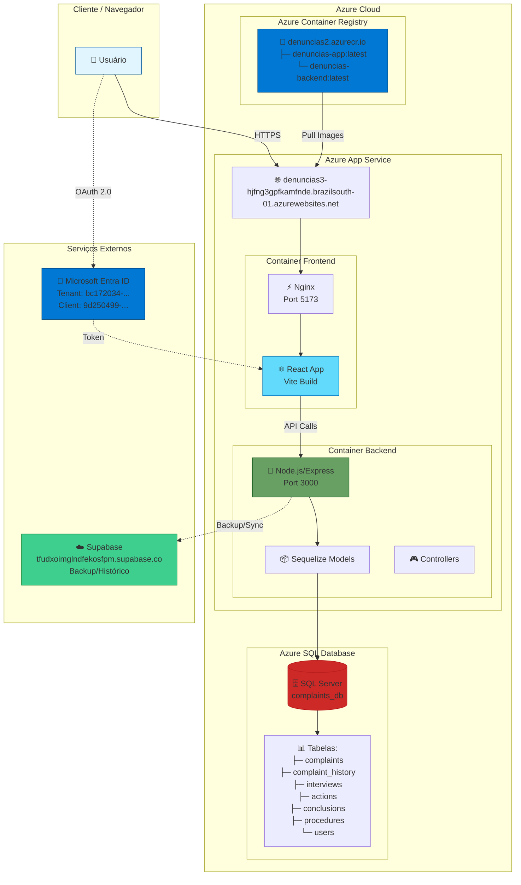

# 🏗️ Arquitetura do Sistema - Denúncias App

## Diagrama de Arquitetura



## 📋 Componentes Detalhados

### 1. **Frontend (React + TypeScript)**
```
┌─────────────────────────────────────────┐
│  React Application (Vite)              │
├─────────────────────────────────────────┤
│  📁 Components:                         │
│    ├─ Dashboard.tsx                     │
│    ├─ ComplaintModal.tsx                │
│    ├─ ComplaintInfo.tsx                 │
│    ├─ ComplaintActions.tsx              │
│    ├─ ComplaintInterviews.tsx           │
│    ├─ ComplaintConclusion.tsx           │
│    └─ UI Components (Shadcn)            │
│                                          │
│  📁 Services:                            │
│    ├─ api.ts (REST Client)              │
│    ├─ complaintService.ts               │
│    ├─ actionService.ts                  │
│    ├─ interviewService.ts               │
│    └─ conclusionService.ts              │
│                                          │
│  🔐 Authentication:                      │
│    ├─ MsalAuthProvider.tsx              │
│    ├─ AuthContext.tsx                   │
│    └─ msal-config.ts                    │
└─────────────────────────────────────────┘
         │
         ▼
    Nginx Reverse Proxy
         │
         ▼
    Port 5173 (HTTP)
```

### 2. **Backend (Node.js + Express)**
```
┌─────────────────────────────────────────┐
│  Express Server (Node.js 18)           │
├─────────────────────────────────────────┤
│  📁 Routes:                             │
│    ├─ /api/complaints                   │
│    ├─ /api/interviews                   │
│    ├─ /api/actions                      │
│    ├─ /api/conclusions                  │
│    ├─ /api/procedures                   │
│    └─ /api/users                        │
│                                          │
│  🎮 Controllers:                         │
│    ├─ complaintController.js            │
│    ├─ interviewController.js            │
│    ├─ actionController.js               │
│    ├─ conclusionController.js           │
│    └─ procedureController.js            │
│                                          │
│  📦 Models (Sequelize ORM):              │
│    ├─ Complaint                         │
│    ├─ Interview                         │
│    ├─ Action                            │
│    ├─ Conclusion                        │
│    ├─ Procedure                         │
│    ├─ ComplaintHistory                  │
│    └─ User                              │
│                                          │
│  🔧 Middleware:                          │
│    ├─ CORS                              │
│    ├─ Body Parser                       │
│    ├─ File Upload (express-fileupload)  │
│    └─ Error Handler                     │
└─────────────────────────────────────────┘
         │
         ▼
    Port 3000 (HTTP)
```

### 3. **Banco de Dados (SQL Server)**
```
┌─────────────────────────────────────────┐
│  Azure SQL Database / SQL Server        │
├─────────────────────────────────────────┤
│                                          │
│  📊 Tabela: complaints                   │
│    ├─ id (UUID, PK)                     │
│    ├─ number (VARCHAR)                  │
│    ├─ category (VARCHAR)                │
│    ├─ characteristic (VARCHAR)          │
│    ├─ status (VARCHAR)                  │
│    ├─ responsible_instance (VARCHAR)    │
│    ├─ responsible1 (VARCHAR)            │
│    ├─ responsible2 (VARCHAR)            │
│    ├─ received_date (DATE)              │
│    ├─ description (TEXT)                │
│    ├─ procedures (TEXT/JSON)            │
│    ├─ complaint_attachment (BLOB)       │
│    ├─ complaint_attachment_name         │
│    ├─ complaint_attachment_type         │
│    ├─ evidence_attachment (BLOB)        │
│    ├─ evidence_attachment_name          │
│    ├─ evidence_attachment_type          │
│    ├─ created_at (TIMESTAMP)            │
│    └─ updated_at (TIMESTAMP)            │
│                                          │
│  📊 Tabela: complaint_history            │
│  📊 Tabela: interviews                   │
│  📊 Tabela: actions                      │
│  📊 Tabela: conclusions                  │
│  📊 Tabela: procedures                   │
│  📊 Tabela: users                        │
└─────────────────────────────────────────┘
```

## 🔄 Fluxo de Dados

### Fluxo de Criação de Denúncia

```
┌─────────┐       ┌──────────┐       ┌─────────┐       ┌──────────┐
│ Usuário │──────>│ Frontend │──────>│ Backend │──────>│ Database │
└─────────┘       └──────────┘       └─────────┘       └──────────┘
     │                  │                  │                  │
     │ 1. Preenche      │                  │                  │
     │    formulário    │                  │                  │
     │                  │                  │                  │
     │ 2. Anexa         │                  │                  │
     │    arquivos      │                  │                  │
     │                  │                  │                  │
     │─────────────────>│ 3. POST /api/    │                  │
     │                  │    complaints    │                  │
     │                  │─────────────────>│ 4. Valida dados  │
     │                  │                  │                  │
     │                  │                  │ 5. Converte      │
     │                  │                  │    anexos p/BLOB │
     │                  │                  │                  │
     │                  │                  │ 6. INSERT INTO   │
     │                  │                  │    complaints    │
     │                  │                  │─────────────────>│
     │                  │                  │                  │
     │                  │                  │ 7. Cria registro │
     │                  │                  │    de histórico  │
     │                  │                  │─────────────────>│
     │                  │                  │                  │
     │                  │ 8. Retorna       │                  │
     │                  │    denúncia      │                  │
     │                  │<─────────────────│                  │
     │                  │                  │                  │
     │ 9. Atualiza UI   │                  │                  │
     │<─────────────────│                  │                  │
```

### Fluxo de Autenticação (Microsoft Entra ID)

```
┌─────────┐       ┌──────────┐       ┌─────────────┐
│ Usuário │       │ Frontend │       │ Entra ID    │
└─────────┘       └──────────┘       └─────────────┘
     │                  │                    │
     │ 1. Clica Login   │                    │
     │─────────────────>│                    │
     │                  │                    │
     │                  │ 2. Redireciona p/  │
     │                  │    login Microsoft │
     │                  │───────────────────>│
     │                  │                    │
     │ 3. Insere        │                    │
     │    credenciais   │                    │
     │───────────────────────────────────────>│
     │                  │                    │
     │                  │ 4. Retorna token   │
     │                  │<───────────────────│
     │                  │                    │
     │ 5. Armazena      │                    │
     │    token e       │                    │
     │    exibe app     │                    │
     │<─────────────────│                    │
     │                  │                    │
     │ 6. Todas as      │                    │
     │    requests      │                    │
     │    incluem       │                    │
     │    Bearer token  │                    │
```

## 🚀 Processo de Deploy

```
┌──────────────┐    ┌──────────────┐    ┌──────────────┐
│  Developer   │───>│ Docker Build │───>│     ACR      │
│   Machine    │    │   & Tag      │    │  Registry    │
└──────────────┘    └──────────────┘    └──────────────┘
       │                                        │
       │ build-azure.ps1                       │
       │                                        │
       ▼                                        ▼
┌──────────────────────────────────────────────────────┐
│  1. Build Frontend Image:                            │
│     docker build --build-arg VITE_API_URL_BACKEND=.. │
│                                                       │
│  2. Build Backend Image:                             │
│     docker build -f backend/Dockerfile               │
│                                                       │
│  3. Tag Images:                                      │
│     docker tag → denuncias2.azurecr.io/*:latest     │
│                                                       │
│  4. Push to ACR:                                     │
│     az acr login --name denuncias2                   │
│     docker push denuncias2.azurecr.io/*:latest      │
│                                                       │
│  5. Azure App Service pulls and runs containers      │
└──────────────────────────────────────────────────────┘
```

## 🔧 Variáveis de Ambiente

### Frontend (Build Time)
```bash
VITE_API_URL_BACKEND=https://denuncias3-hjfng3gpfkamfnde.brazilsouth-01.azurewebsites.net
VITE_MSAL_TENANT_ID=9c36f529-164f-47cd-bca0-ba7c0d710407
VITE_MSAL_CLIENT_ID=cdd76ec6-77b7-4eb0-a9ec-2efd6b498c46
VITE_SUPABASE_URL=https://tfudxoimglndfekosfpm.supabase.co
VITE_SUPABASE_ANON_KEY=eyJhbGciOiJIUzI1NiIsInR5cCI6IkpXVCJ9...
```

### Backend (Runtime)
```bash
NODE_ENV=production
PORT=3000
DB_USER=adm_user
DB_PASSWORD=YourStrong!Passw0rd
DB_SERVER=complaints-server.database.windows.net
DB_NAME=complaints_db
CORS_ORIGIN=https://denuncias3-hjfng3gpfkamfnde.brazilsouth-01.azurewebsites.net
```

## 📊 Tecnologias Utilizadas

| Camada | Tecnologia | Versão | Propósito |
|--------|-----------|---------|-----------|
| **Frontend** | React | 18.x | UI Framework |
| | TypeScript | 5.x | Type Safety |
| | Vite | 5.x | Build Tool |
| | Tailwind CSS | 3.x | Styling |
| | Shadcn UI | - | Component Library |
| | Recharts | 2.x | Gráficos |
| **Backend** | Node.js | 18.x | Runtime |
| | Express | 4.x | Web Framework |
| | Sequelize | 6.x | ORM |
| **Database** | SQL Server | - | Relational DB |
| **Auth** | MSAL | 3.x | Microsoft Auth |
| **Deploy** | Docker | - | Containerization |
| | Azure ACR | - | Registry |
| | Azure App Service | - | Hosting |
| **Backup** | Supabase | - | Cloud Backend |

## 🔐 Segurança

1. **Autenticação**: Microsoft Entra ID (Azure AD) via MSAL
2. **CORS**: Configurado para permitir apenas domínios autorizados
3. **HTTPS**: Todas as comunicações criptografadas
4. **Tokens**: Bearer tokens em todas as requisições autenticadas
5. **Uploads**: Validação de tipo e tamanho de arquivo
6. **SQL Injection**: Proteção via Sequelize ORM

## 📈 Escalabilidade

- Frontend servido via Nginx (pode usar CDN)
- Backend stateless (pode escalar horizontalmente)
- Database: Azure SQL Database (escalável)
- Container Registry: Suporta múltiplas versões
- App Service: Pode adicionar mais instâncias

---

**Gerado em**: Outubro 2025  
**Versão do Sistema**: 1.0  
**Status**: Em Produção
